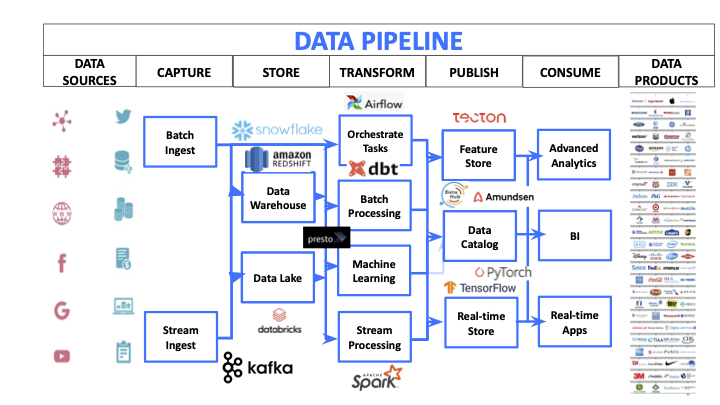

# Data Pipeline Tools: An Annotated Bibliography

[Jim Tyhurst](https://www.jimtyhurst.com) 
2020-08-21

**Table of Contents**

* [Introduction](#introduction)
* [Notation](#notation)
* [Tags used in this document](#tags-used-in-this-document)
* [Alteryx](#alteryx)
* [Apache Airflow](#apache-airflow)
* [Apache Beam](#apache-beam)
* [Argo Workflows](#argo-workflows)
* [CKAN](#ckan)
* [Dask](#dask)
* [Databricks](#databricks)
* [Google Cloud Dataflow](#google-cloud-dataflow)
* [DataPackageR](#datapackager)
* [dbt](#dbt)
* [DKAN](#dkan)
* [drake](#drake)
* [Frictionless Data](#frictionless-data)
* [KNIME](#knime)
* [Kubeflow](#kubeflow)
* [luigi](#luigi)
* [MLeap](#mleap)
* [MLflow](#mlflow)
* [Prefect](#prefect)
* [RapidMiner](#rapidminer)
* [snorkel](#snorkel)
* [StreamSets](#streamsets)
* [targets](#targets)
* [TensorFlow Extended](#tensorFlow-extended)
* [workflowr](#workflowr)
* [Workspace](#workspace)
* [References](#references)

## Introduction
The purpose of this document is to provide a quick reference to software tools, frameworks, and environments that are used to create or manage data pipelines. The tools listed here are not all equivalent in terms of functionality, but each touches some aspect of transforming data from its source to some other format or location where it is available for analysis. I have used some tags to try to show the focus of the different tools.

I am mostly interested in cleaning and transforming data for machine learning or statistical analysis. Therefore, I have not included any "extract, transform, load" (ETL) tools, which are typically limited to transforming data from one SQL database to another, although that certainly qualifies as a "data pipeline" also.

This is a work in process and I am just getting started. Any additions or corrections would be appreciated.

### Typical stages in a data pipeline

From Shivnath Babu. 2021-08-02. Data Pipeline HealthCheck for Correctness, Performance, and Cost Efficiency. [Apache Summit 2021](https://airflowsummit.org/sessions/2021/). [Slides](https://airflowsummit.org/slides/2021/z6-PipelineHealthcheck.pdf), p. 6. [Video](https://www.youtube.com/watch?v=rvl-9cldMiU).

## Notation
Descriptions in quotes are taken directly from the tool's documentation or web site.

## Tags used in this document
* data\_catalog
* data\_engineering
* data\_publishing
* data\_streams
* data\_transformation
* kubernetes
* platform
* python
* reproducibility
* rstats
* workflow

## [Alteryx](https://www.alteryx.com/)
Tags: platform, workflow, reproducibility, rstats, python

"Our platform is purpose-built to create new data partnerships among IT, analytic teams, and the lines of business."

## [Apache Airflow](https://airflow.apache.org/)
Tags: workflow

"Airflow is a platform to programmatically author, schedule and monitor workflows. Use airflow to author workflows as directed acyclic graphs (DAGs) of tasks."

## [Apache Beam](https://beam.apache.org/)
Tags: workflow, python

"Implement batch and streaming data processing jobs that run on any execution engine."

"Using one of the open source Beam SDKs, you build a program that defines the pipeline. The pipeline is then executed by one of Beam’s supported distributed processing back-ends, which include Apache Apex, Apache Flink, Apache Spark, and Google Cloud Dataflow."

## [Apache NiFi](https://nifi.apache.org)
Tags: workflow

"Apache NiFi supports powerful and scalable directed graphs of data routing, transformation, and system mediation logic." including: Web-based user interface, Highly configurable, Data Provenance, Designed for extension, Secure.

## [Argo Workflows](https://argoproj.github.io/argo/)
Tags: workflow, kubernetes

"Container-native Workflow Engine" ... "tools for getting work done with Kubernetes."

## [CKAN](https://ckan.org/)
Tags: data\_publishing, data\_catalog

"CKAN is a powerful data management system that makes data accessible – by providing tools to streamline publishing, sharing, finding and using data."

## [Dask](https://dask.org/)
Tags: python, workflow

"Dynamic task scheduling optimized for computation. This is similar to Airflow, Luigi, Celery, or Make, but optimized for interactive computational workloads."

## [Databricks](https://www.databricks.com/)
Tags: workflow

"Unified Data Analytics Platform: One cloud platform for massive scale data engineering and collaborative data science."

"The Databricks Unified Data Service provides a reliable and scalable platform for your data pipelines, data lakes, and data platforms. Manage your full data journey, so you can ingest, process, store, and expose data throughout your organization."

## [Dataiku](https://www.dataiku.com/)
Tags: platform, workflow

"Your Path to Enterprise AI: Bring data analysts, engineers, and scientists together. Enable self-service analytics and operationalize machine learning."

## [Google Cloud Dataflow](https://cloud.google.com/dataflow/docs/guides/deploying-a-pipeline)
Tags: workflow

"Cloud Dataflow is a fully-managed service for transforming and enriching data in stream (real time) and batch (historical) modes with equal reliability and expressiveness -- no more complex workarounds or compromises needed."

## [DataPackageR](https://cran.r-project.org/package=DataPackageR)
Tags: rstats

"A framework to help construct R data packages in a reproducible manner. Potentially time consuming processing of raw data sets into analysis ready data sets is done in a reproducible manner and decoupled from the usual R CMD build process so that data sets can be processed into R objects in the data package and the data package can then be shared, built, and installed by others without the need to repeat computationally costly data processing. The package maintains data provenance by turning the data processing scripts into package vignettes, as well as enforcing documentation and version checking of included data objects. Data packages can be version controlled in github, and used to share data for manuscripts, collaboration and general reproducibility."

## [dbt](https://www.getdbt.com/)
Tags: data\_engineering, data\_transformation

"With dbt, analysts take ownership of the entire analytics engineering workflow, from writing data transformation code to deployment and documentation."

## [DKAN](https://getdkan.org/)
Tags: data\_publishing, data\_catalog

"open data platform that gives organizations and individuals ultimate freedom to publish and consume structured information."

## [drake](https://docs.ropensci.org/drake/)
Tags: rstats, reproducibility

"drake analyzes your workflow, skips steps with up-to-date results, and orchestrates the rest with optional distributed computing."

## [Frictionless Data](https://frictionlessdata.io/)
Tags: data\_transformation

"collection of specifications and software for the publication, transport, and consumption of data."

"[datapackage-pipelines](https://github.com/frictionlessdata/datapackage-pipelines) is a framework for declarative stream-processing of tabular data."

## [KNIME](https://www.knime.com/)
Tags: workflow, data\_transformation

"Gather and shape data from any source ... KNIME Software allows you to connect to these varied data sources in one intuitive, visual workflow environment. Within this environment, a broad range of additional functionalities make data transformation, cleaning, and aggregating steps easy."

## [Kubeflow](https://www.kubeflow.org/)
Tags: workflow, kubernetes

"dedicated to making deployments of machine learning (ML) workflows on Kubernetes simple, portable and scalable."

"Kubeflow Pipelines is a platform for building, deploying, and managing multi-step ML workflows based on Docker containers."

## [luigi](https://github.com/spotify/luigi)
Tags: python, workflow

"Luigi is a Python (2.7, 3.6, 3.7 tested) package that helps you build complex pipelines of batch jobs. It handles dependency resolution, workflow management, visualization, handling failures, command line integration, and much more."

## [MLeap](https://github.com/combust/mleap)
Tags: data\_engineering

"MLeap is a common serialization format and execution engine for machine learning pipelines."

"MLeap allows data scientists and engineers to deploy machine learning pipelines from Spark and Scikit-learn to a portable format and execution engine."

## [MLflow](https://mlflow.org/)
Tags: workflow, reproducibility

"MLflow is an open source platform to manage the ML lifecycle, including experimentation, reproducibility and deployment."

## [Prefect](https://www.prefect.io/)
Tags: workflow, python

"Users organize Tasks into Flows, and Prefect takes care of the rest."

## [RapidMiner]()
Tags: platform, workflow

"Ingest & transform data from any source. Automate the selection and validation of the best ML models. Deploy and optimize models in production to drive revenue, cut costs, and avoid risks"

## [snorkel](https://www.snorkel.org/)
Tags: data\_engineering

"Build training sets programmatically"

## [StreamSets](https://streamsets.com/)
Tags: data\_streams

"Ensure continuous data flows for modern analytics"

## [targets](https://github.com/wlandau/targets)
Tags: rstats, reproducibility

"The `targets` package is a [Make](https://www.gnu.org/software/make/)-like pipeline toolkit for Statistics and data science in R."

This is a new project by the author of the [drake](#drake) package.

## [TensorFlow Extended](https://www.tensorflow.org/tfx/)  (TFX)
Tags: workflow, reproducibility

"When you’re ready to move your models from research to production, use TFX to create and manage a production pipeline."

## [workflowr](https://github.com/jdblischak/workflowr)
Tags: rstats, workflow

"generate a website containing time-stamped, versioned, and documented results."

## [Workspace](https://research.csiro.au/workspace/)
Tags: workflow

"Intuitive workflow editing environment ... Interactively combine powerful operations into scientific workflows, modify them, and execute them."

## References

Michael Li. 2015-09-15. [Three best practices for building successful data pipelines](https://www.oreilly.com/ideas/three-best-practices-for-building-successful-data-pipelines): Reproducibility, consistency, and productionizability let data scientists focus on the science.

Catherine Nelson, Hannes Hapke. 2019. [Building Machine Learning Pipelines](https://www.oreilly.com/library/view/building-machine-learning/9781492053187/): Automating Model LifeCycles with TensorFlow.
